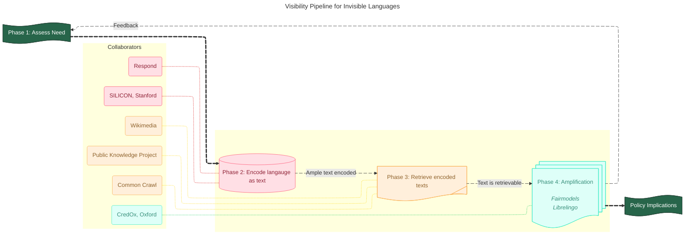

# invisible-languages

**Community-led tools and resources for making underrepresented languages usable online.**

Supporting communities to make their languages typable, findable, and sustainable in digital spaces - from keyboards and fonts to preservation and learning pathways.

[Learn more](https://theinvisiblelab.org/languages)

